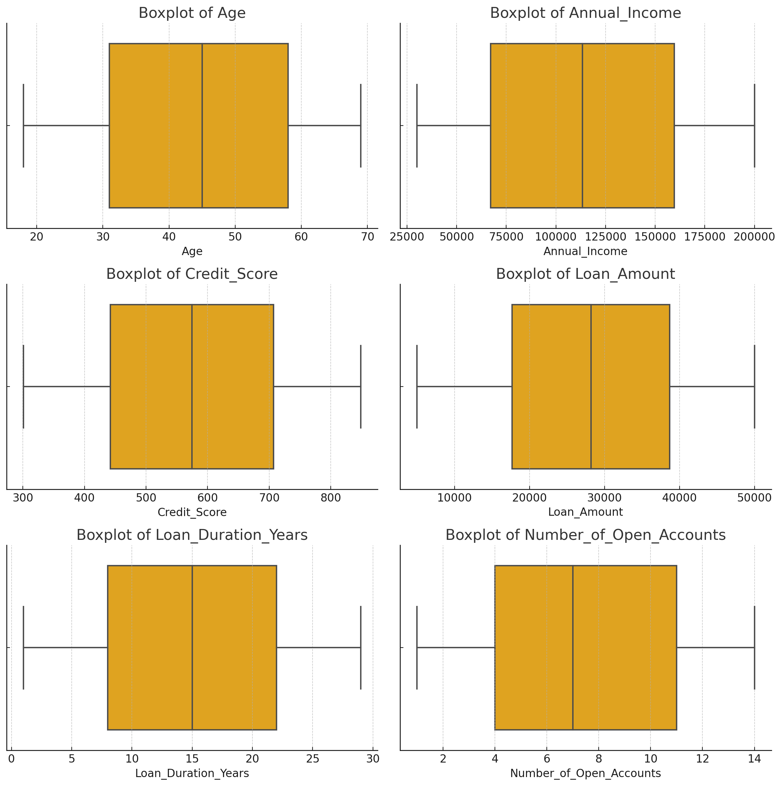

# MLE Challenge Project

This project is a FastAPI-based microservice designed to predict loan approvals. The model is a simple logistic regression that takes input features like age, annual income, credit score, loan amount, and more. The project is containerized using Docker to facilitate deployment on any cloud provider.

## Project Structure

```
MLE-CHALLENGE
├── dataset.csv           # Dataset for training the model (temporary)
├── .env                  # Environment variables, including DATASET_PATH
├── requirements.txt      # Python dependencies
├── Dockerfile            # Docker configuration
├── README.md             # Project documentation
└── src
    ├── models
    │   ├── loan_application.py   # Pydantic model for input validation
    │   ├── training_data.py      # Pydantic model for training data
    └── main.py                   # Main FastAPI application code
```

## Local Execution Guide

### Prerequisites
- You need to have a `.env` file configured with at least the `DATASET_PATH` variable and a `dataset.csv` file for training the model. Both should be in the working directory.
- Example `.env`:
  ```bash
  DATASET_PATH=./dataset.csv
  ```

### Running the Application with Uvicorn

1. **Install dependencies**:
   
   Create and activate a virtual environment and install dependencies:

   ```bash
   python3 -m venv venv
   source venv/bin/activate
   pip install -r requirements.txt
   ```

2. **Run FastAPI with Uvicorn**:

   Use the following command to run the app locally:

   ```bash
   uvicorn src.main:app --reload --host 0.0.0.0 --port 8000
   ```

3. **Access the API**:

   The API will be available at `http://localhost:8000`. You can access the automatically generated docs at `http://localhost:8000/docs`.

### Running with Docker

1. **Build the Docker image**:

   ```bash
   docker build -t loan-approval-app .
   ```

2. **Run the Docker container**:

   ```bash
   docker run -d -p 8000:8000 --env-file .env loan-approval-app
   ```

3. **Access the API**:

   The API will be available at `http://localhost:8000` when using Docker. Documentation for API requests is available at `http://localhost:8000/docs`.

---

## Deployment Guide on a Cloud Provider

This project is designed to be cloud-agnostic, meaning the same Docker container can be deployed on any cloud provider (AWS, GCP, Azure, etc.). However, for this guide, we will describe how to deploy the project automatically on **Google Cloud Platform (GCP)** using **Jenkins** as a CI/CD tool to automate the process.

### Deployment Pipeline Overview

The project is hosted on **GitHub**, and we will use **Jenkins** to listen for changes in certain branches (`main`, `release/**`, or `develop`). When changes are detected, Jenkins will automatically trigger a pipeline that does the following:

1. **Builds the Docker image** from the latest changes.
2. **Pushes the Docker image** to **Google Container Registry (GCR)** or a similar container registry in other cloud providers.
3. **Deploys the Docker image** to a serverless platform (like **Google Cloud Run**, **AWS Fargate**, or **Azure Container Instances**).

### Setting Up Jenkins

1. **Jenkins Webhook Integration**:

   First, configure a webhook in GitHub to notify Jenkins of any changes to the `master`, `release/**`, or `develop` branches.

2. **Jenkins Pipeline Script**:

   The Jenkins pipeline will consist of the following stages:
   
   - **Checkout**: Pulls the latest code from GitHub.
   - **Build Docker Image**: Builds the Docker image using the `Dockerfile`.
   - **Push Image to Container Registry**: Pushes the newly built image to GCR or a similar registry.
   - **Deploy**: Deploys the image to a serverless environment, such as **Google Cloud Run**.

   Example Jenkins pipeline (`Jenkinsfile`):

   ```groovy
   pipeline {
       agent any
       environment {
           GCP_PROJECT = 'google-cloud-project-id'
           IMAGE_NAME = "gcr.io/${GCP_PROJECT}/loan-approval-app"
       }
       stages {
           stage('Checkout') {
               steps {
                   git 'https://github.com/zaphod9801/MLE-challenge-loan-application.git'
               }
           }
           stage('Build Docker Image') {
               steps {
                   script {
                       docker.build("${IMAGE_NAME}:$BUILD_NUMBER")
                   }
               }
           }
           stage('Push Docker Image') {
               steps {
                   script {
                       docker.withRegistry('https://gcr.io', 'gcr:google-auth') {
                           docker.image("${IMAGE_NAME}:$BUILD_NUMBER").push()
                       }
                   }
               }
           }
           stage('Deploy to Cloud Run') {
               steps {
                   sh '''
                   gcloud run deploy loan-approval-app \
                       --image ${IMAGE_NAME}:$BUILD_NUMBER \
                       --platform managed \
                       --region us-central1 \
                       --allow-unauthenticated \
                       --port 8000
                   '''
               }
           }
       }
   }
   ```

3. **Environment Configuration**:

   When deploying on **Google Cloud Run** (or any serverless platform), the `.env` file used for local development should be translated into environment variables provided via the cloud provider’s settings. For example:
   
   - On **Google Cloud Run**, you can pass environment variables (like `DATASET_PATH`) using the web console or `gcloud` CLI:
   
     ```bash
     gcloud run deploy loan-approval-app \
         --image gcr.io/your-google-cloud-project-id/loan-approval-app \
         --platform managed \
         --region us-central1 \
         --allow-unauthenticated \
         --set-env-vars DATASET_PATH=/app/dataset.csv \
         --port 8000
     ```

### Serverless Deployment

By using **Google Cloud Run** (or any other serverless platform), the Docker image will run in a scalable environment that can handle incoming requests without manual infrastructure management. The configuration file or environment variables (like the `.env` file) will need to be passed as environment variables directly from the cloud provider.

This ensures that the application can automatically scale based on incoming traffic and minimizes manual server management.

---

## Note on Using `dataset.csv` for Training

Although this project currently uses a `dataset.csv` file for training the model, this approach is **not ideal** in a production environment. Instead, the model training process should retrieve data from a more robust, scalable data source such as:

- **Databases** (e.g., PostgreSQL, MySQL)
- **Data warehouses** (e.g., Google BigQuery, Amazon Redshift, Snowflake)
- **Cloud storage services** (e.g., Google Cloud Storage, AWS S3)

### Ideal Approach

1. **Data Source**:
   - The `DATASET_PATH` variable should be replaced with relevant information such as a **connection string**, **SQL query**, or **API endpoint** that allows the application to fetch the data needed for training.
   - For example, if the data is stored in **Google BigQuery**, you could pass a BigQuery query or dataset reference as an environment variable.

2. **Authentication**:
   - Authentication to access such services should be handled securely using methods like:
     - **Service account keys** (`key.json` files for Google Cloud, AWS tokens, etc.).
     - **OAuth tokens** for APIs.
   - These authentication tokens or keys should be passed as environment variables or mounted as secrets in the cloud provider.
   
   Example environment variables in the `.env` file:
   
   ```bash
   BIGQUERY_DATASET_ID=my_project.my_dataset
   GOOGLE_APPLICATION_CREDENTIALS=/path/to/key.json
   ```

   In a serverless environment like **Google Cloud Run**, the `GOOGLE_APPLICATION_CREDENTIALS` path can be passed as a secret or configured through the cloud provider's environment settings.

By adopting this approach, the model can always be trained on fresh, real-time data, which improves accuracy and scalability in a production environment.


## Model Performance and Limitations

### Current Model Performance
The current logistic regression model used in this project has poor performance, as demonstrated by its predictions on the dataset. Several alternative machine learning models, including RandomForestClassifier and XGBoost, were tested to improve the performance. Additionally, feature engineering techniques were applied to enhance the dataset quality. Unfortunately, none of these attempts led to any significant improvement in performance.

### Correlation Analysis
A quick exploratory data analysis (EDA) revealed that the features in the dataset had very low correlation coefficients with the target variable (loan approval). The highest correlation values found were:

- Annual_Income with a correlation coefficient of 0.05.
- Had_Past_Default with a correlation coefficient of -0.06.


These low correlation values suggest that the features are not strong predictors of the target variable, which could explain the poor model performance.

### Outlier Detection
During the EDA, no significant outliers were found in the dataset, further supporting the hypothesis that the low model performance is likely due to the dataset not containing strong predictive features. The low correlations and lack of strong feature signals make it difficult for any machine learning model to make accurate predictions.



In conclusion, the dataset may need to be enriched with more relevant features or a different data source to improve the predictive power of the model.